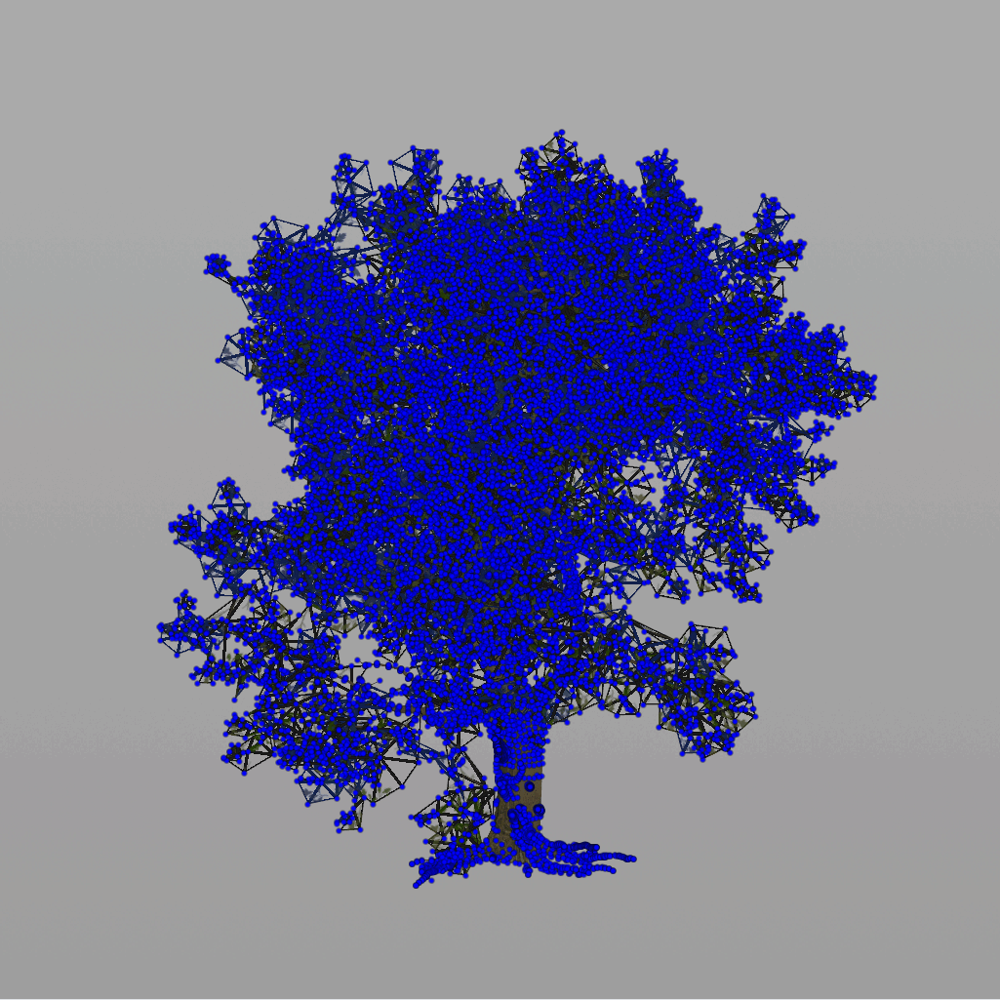

# [🔗 link] — 一种植被Impostor方法——Billboard Clouds

Billboard Clouds方法来制作Impostor的思路就是使用多个角度的切片来替代这个模型。在较远距离看上去与原物体类似，这个非常像8x8Atlas的Billboard Impostor，只是后者将64个角度烘焙在了贴图上，而Billboard Cloud则是创建多个角度的面片，这些面片的合即为多个角度观察物体的合集。

所以找到合适角度的面片是该算法需要解决的主要问题。显然这里可以运用一些量化手段，将最能代表物体的角度求出来。因此该算法就是为了求出最有特征角度面片的算法。

本文中的代码示例为OpenCL。

## 准备

### 面的表示

因为我们最后的结果是一堆面片嘛，所以我们要有一个面片的表达方式，方便我们记录。一个面可以用一个位置和一个法线来定义： P(Loc,Nor)P(Loc,Nor) ，表示面片穿过Loc点，并且与Nor垂直。但是这里位置和法线方向各为一个vector，因此一个面的表示需要六位浮点，显然不方便我们记录和计算。于是又引入另一个概念：

### 球形坐标系


上图中的xyz轴为笛卡尔坐标系，也就是我们常用的坐标系。而 （θ,φ,r）（\theta , \varphi, r）表示了位置和方向。在球形坐标系下表示一个面只需要3个浮点，因此我们可以用一个转换公式来转换两个坐标系，从而让一个Vector来表示一个面 P（θ,φ,r）P（\theta , \varphi, r） 。

其实球形坐标可不仅仅是为了简化面的表示，在Billboard Clouds中，球形坐标系有非常重要的作用，可以大大得节省我们的计算复杂度，后面我们可以看到。

### Bin

在本文引用的论文中，还有一个非常重要的概念——Bin，这个概念是论文自己为了计算而设置的，因此我们要单独理解。

Bin是一个球形坐标系中的一个连续范围空间，即 B（θ,φ,r）θ∈[θa,θb],φ∈[φa,φb],r∈[ra,rb]B（\theta , \varphi, r）\theta \in[\theta_a,\theta_b] ,\varphi\in[\varphi_a,\varphi_b],r\in[r_a,r_b] ，如果在笛卡尔坐标系下很好理解，就是一个矩形嘛。而在球形坐标系中，他是一个洋葱切片的形状，


即下图红色部分：


准备工作完成，目前不理解不用慌，这三个概念会贯穿整个算法中。这时候我们不免会有些疑问，我们搞这么多抽象干啥，为啥要转来转去的？其实搞抽象真的不是为了显得高大上，而是有些问题在不同的表达空间中，会容易解决很多。

另外我们可以YY下当初发明这个算法的人的思路：

想用一堆**不同角度的面片**来代替一个三维立体的物体->这些角度是**以物体为中心，面向所有方向**的->所有角度的集合就是一个**球**->在球形坐标系方便**量化**与**遍历**->选球形坐标系！

接下来，我们开始正题。

### 贪心算法

一句话总结，Billboard Clouds 就是一个贪心算法，即遍历所有角度（我们输入数值控制最终数量），然后找到最能代表物体的角度，保留该角度。大道至简，没想到如此暴力（但也是优化的点）。但开始前，我们面临三个棘手问题：

- 确定遍历的角度
- 比较标准（即怎么量化”最能代表物体的角度“）
- 停止条件

只有确定好这三个问题，我们才能创建贪心算法。

下面论文中的伪代码，暂时我们不必理解，看完全文再看便豁然开朗。


### 确定遍历的角度

因为我们转到了球形坐标，因此这一步已经很简单了，我们只需要在球形坐标中，对 （θ,φ,r）（\theta , \varphi, r） 进行平分，然后遍历即可。在笛卡尔坐标与球形坐标之间转换用下面公式：

```
float3 sphericalCoordToOrthogonal(float r, float theta, float phi)
{
    return (float3)(cos(phi) * sin(theta) * r, // x
                    sin(phi) * r,              // y
                    cos(phi) * cos(theta) * r  // z
                    );
}// 这里笛卡尔坐标系为——y轴朝上的右手坐标系
```

我们想象着一个洋葱即为我们的球形空间，而且模型被洋葱正好包裹。这个洋葱的每一层其实就是我们的一个切片，其三个坐标代表着一个平面。

我们分别将 （θ,φ,r）（\theta , \varphi, r） 切 N,M,LN,M,L 次，每个切分量上的面片可以表示为 P(θn,φm,rl)P(\theta_n, \varphi_m, r_l) ，面的法线表示为 N(θn,φm)N(\theta_n, \varphi_m) 。但这里我们会发现，我们只是采样了球形坐标系上的一些点而非一个空间，此时，我们需要将Bin的概念引入。即以 (θn,φm,rl)(\theta_n, \varphi_m, r_l) 点为中心，上下左右各个维度各取一段距离（平均切分距离的一半）。形成一个“洋葱切块”的形状范围（下图体块）。现在我们就可以遍历这些“洋葱切块”，就能遍历整个空间。


现在我们便有了能够遍历的容器。接下来，我们要确定向这个容器里加入什么东西，以便我们最后将这些容器进行比较，选出一个最好的容器（最好的角度）。

### 比较标准(量化方法)

对于每个Bin内的计算，可以看作是在求物体投影到这个Bin中每个点 (θn,φm,rl)(\theta_n, \varphi_m, r_l) 对用的面上的面积。如下图：


其实我们可以事先求得物体每个面的面积，如树叶模型的每个面的大小。然后通过模型点坐标与Bin内平面的法线进行点积，即可求得最终投影面积: S=dot(Pinput,Nplane)S = dot(P_{input}, N_{plane}) 。



但我们只考虑距离投影面一定距离内的模型，超过这个距离我们就不再进行投影了。


在一个方向上，三角形范围可能贯穿多个bin，如上图中蓝色部分。我们需要将其面积根据距离进行等比例的分配给每个bins中。论文中还引入了 ε\varepsilon这个变量，由使用者输入，作为一个惩罚值，以便获得一个"理想效果"，可以理解为一个调整参数。

下面这个函数就来求一个三角面在Bin内的投影范围，一遍将其面积分配给哪些Bin中。

```
float2 get_roMinMax(float3 p0, float3 p1, float3 p2,
    float curThetaMin, float curThetaMax, float curPhiMin, float curPhiMax,
    float epsilon, float roMin, float roMax)
{
    float3 normal_1 = normalize(sphericalCoordToOrthogonal(1.0f, curThetaMin, curPhiMin));
    float3 normal_2 = normalize(sphericalCoordToOrthogonal(1.0f, curThetaMin, curPhiMax));
    float3 normal_3 = normalize(sphericalCoordToOrthogonal(1.0f, curThetaMax, curPhiMin));
    float3 normal_4 = normalize(sphericalCoordToOrthogonal(1.0f, curThetaMax, curPhiMax));
    float ro_p0_n1 = dot(p0, normal_1);
    float ro_p0_n2 = dot(p0, normal_2);
    float ro_p0_n3 = dot(p0, normal_3);
    float ro_p0_n4 = dot(p0, normal_4);
    float ro_p1_n1 = dot(p1, normal_1);
    float ro_p1_n2 = dot(p1, normal_2);
    float ro_p1_n3 = dot(p1, normal_3);
    float ro_p1_n4 = dot(p1, normal_4);
    float ro_p2_n1 = dot(p2, normal_1);
    float ro_p2_n2 = dot(p2, normal_2);
    float ro_p2_n3 = dot(p2, normal_3);
    float ro_p2_n4 = dot(p2, normal_4);
    float ro_p0_min_n = min( min( min((ro_p0_n1 - epsilon),(ro_p0_n2 - epsilon)),(ro_p0_n3 - epsilon)),(ro_p0_n4 - epsilon));
    float ro_p1_min_n = min( min( min((ro_p1_n1 - epsilon),(ro_p1_n2 - epsilon)),(ro_p1_n3 - epsilon)),(ro_p1_n4 - epsilon));
    float ro_p2_min_n = min( min( min((ro_p2_n1 - epsilon),(ro_p2_n2 - epsilon)),(ro_p2_n3 - epsilon)),(ro_p2_n4 - epsilon));
    // ro_min
    float ro_max_p_min_n = min(max(max(ro_p0_min_n, ro_p1_min_n), ro_p2_min_n), roMax);
    if( ro_max_p_min_n < roMin)
        ro_max_p_min_n = roMin;
    float ro_p0_max_n = max( max( max((ro_p0_n1 + epsilon),(ro_p0_n2 + epsilon)),(ro_p0_n3 + epsilon)),(ro_p0_n4 + epsilon));
    float ro_p1_max_n = max( max( max((ro_p1_n1 + epsilon),(ro_p1_n2 + epsilon)),(ro_p1_n3 + epsilon)),(ro_p1_n4 + epsilon));
    float ro_p2_max_n = max( max( max((ro_p2_n1 + epsilon),(ro_p2_n2 + epsilon)),(ro_p2_n3 + epsilon)),(ro_p2_n4 + epsilon));
    // ro_max
    float ro_min_p_max_n = min( min( min(ro_p0_max_n, ro_p1_max_n), ro_p2_max_n), roMax);
    if( ro_min_p_max_n >= roMin )
        return (float2)(ro_max_p_min_n, ro_min_p_max_n);
    else
        return (float2)(-1.0f,-1.0f);
}
```

上面的函数中，p0,p1,p2为输入模型一个面的三个点坐标。curThetaMin, curThetaMax, curPhiMin, curPhiMax,roMin, roMax 输入表示一个Bin范围 B（θ,φ,r）θ∈[θa,θb],φ∈[φa,φb],r∈[ra,rb]B（\theta , \varphi, r）\theta \in[\theta_a,\theta_b] ,\varphi\in[\varphi_a,\varphi_b],r\in[r_a,r_b] 。输出三角面在bin的法线方向上的投影最小最大值。即在r轴上的投影范围（上图的 ρ\rho direction）。

接下来，我们根据投影结果，来分配三角面的面积到Bin中。

首先获得每个面的投影结果:

```
float2 roMinMax = get_roMinMax(p0, p1, p2, theta_min[idx], theta_max[idx]
                                         , phi_min[idx], phi_max[idx]
                                         , epsilon, roMin, roMax);
```

先判断结构是否有效。对有效的数据，进行下面的分配：

```
float factor = 0.0; 
if( roMinMax.y != roMinMax.x)
{
if( roMinMax.x <= ro_min[idx] && roMinMax.y >= ro_max[idx])
{
// 0----------|---------====|===============|=======------|---------->
factor = roGap / (roMinMax.y - roMinMax.x);
}else if( roMinMax.x >= ro_min[idx] && roMinMax.x < ro_max[idx] && roMinMax.y > ro_max[idx] )
{
// 0----------|-------------|----------====|----------------|--------->
factor = (ro_max[idx] - roMinMax.x) / (roMinMax.y - roMinMax.x);
}else if( roMinMax.x <= ro_min[idx] && roMinMax.y > ro_min[idx] && roMinMax.y <= ro_max[idx] )
{
// 0----------|-------------|========-----|----------------|--------->
factor = (roMinMax.y - ro_min[idx]) / (roMinMax.y - roMinMax.x);
}
density[idx] += triangle_area *  fabs(dot(cur_bin_normal, trianlge_normal)) * factor * triangle_fixed * viewdep_penalty;
```

这里分为三种有效情况：

|-----------| 表示Bin的范围；======= 表示模型在Bin上的投影范围； +++++表示 ε\varepsilon 惩罚距离；

// 0----------|------====|**==========**|=======---|----------> 投影经过Bin上下限全部

// 0----------|-------------|----------**====**|----------------|---------> 投影只出现在上限一部分

// 0----------|-------------|**=======**-----|----------------|---------> 投影只出现在下限一部分

当然还有一种情况就是不经过，因为我们是统计三角面在Bin中的累计值，不经过就不考虑在内了。

接下来我们需要计算 ε\varepsilon 变量控制的惩罚机制：

```
// add penalty. bins between (ro_min - epsilon, ro_min) ; reference by billboard cloud paper.
// 0--------++|++++++====|==========|=======---|---------->
if((roMinMax.x - epsilon - roMin) > 0)
{
   int roPenaltyCoord = (int)(ceil((roMinMax.x - epsilon - roMin) / roGap));
   if( ro_idx[idx] <= roPenaltyCoord )
   {
    float triangle_area   = area[cpr_idx];
    float3 trianlge_normal = vload3(cpr_idx, tri_normal);
    float3 cur_bin_normal = vload3(idx, bin_normal);
    density[idx] -= triangle_area * fabs(dot(cur_bin_normal, trianlge_normal)) * Penalty.x * roGap / (roMinMax.y - roMinMax.x);
   }
}
```

// 0--------++|++++++====|==========|=======---|----------> 如果Bin的范围在投影后面ε\varepsilon距离内（+++++范围），那就需要减去一定数量的面积。

通过这个计算，我们就能求出每个Bin所累积的面积Density。最后我们取Density最大的Bin作为我们的理想方向。论文中还对这个Bin进行了细分，再次求出更加精确的投影方向，其计算和上面的一样，这里不再赘述。

### 停止条件

贪心算法就是一个递归函数，我们有了函数的主体，接下来我们就要找到一个方法来停止递归。

遍历完所有Bin之后，我们得到了 BinmaxBin_{max} ，顺理成章的可以将投影到 BinmaxBin_{max} 范围内的三角面一并保存成一对数组数据： Result(Binmax,TrianglesBinmax)Result(Bin_{max}, Triangles_{Bin_{max}}) 。并从原来的模型当中去除这些三角面。这样，我们的停止条件也就有了，即当输入的三角面数组为0；

## 后处理

Billboard Clouds算法求出了所有的 Result(Binmax,TrianglesBinmax)Result(Bin_{max}, Triangles_{Bin_{max}}) ，接下来我们还要做常规的Bake处理。这部分与其他方法便没有区别，就不做详细介绍了。组后我们可以获得类似下图的结果：


## 总结

该方法减面效果还是很给力的，但是对于渲染而言，还需要解决法线，AO等问题。而且原方法还有很多可以优化的点，提升算法的执行速度。而且该方法也不支持风场效果。总之还是有一些限制吧。

## 参考

1. 论文 Billboard Clouds Xavier Décoret, Frédo Durand, François X. Sillion, Julie Dorsey. Billboard Clouds. [Research Report] RR-4485, INRIA. 2002. ffinria-00072103f

[https://inria.hal.science/inria-00072103/document​inria.hal.science/inria-00072103/document](https://link.zhihu.com/?target=https%3A//inria.hal.science/inria-00072103/document)

2. Github C++ Billboard Clouds:

[https://github.com/StrongerSuperman/Billboardcloud​github.com/StrongerSuperman/Billboardcloud](https://link.zhihu.com/?target=https%3A//github.com/StrongerSuperman/Billboardcloud)

3. 我之前做的一个Houdini HDA，年久失修，不保证能用 :D

[https://github.com/Liuzkai/BillboardCloudsHDA.git​github.com/Liuzkai/BillboardCloudsHDA.git](https://link.zhihu.com/?target=https%3A//github.com/Liuzkai/BillboardCloudsHDA.git)